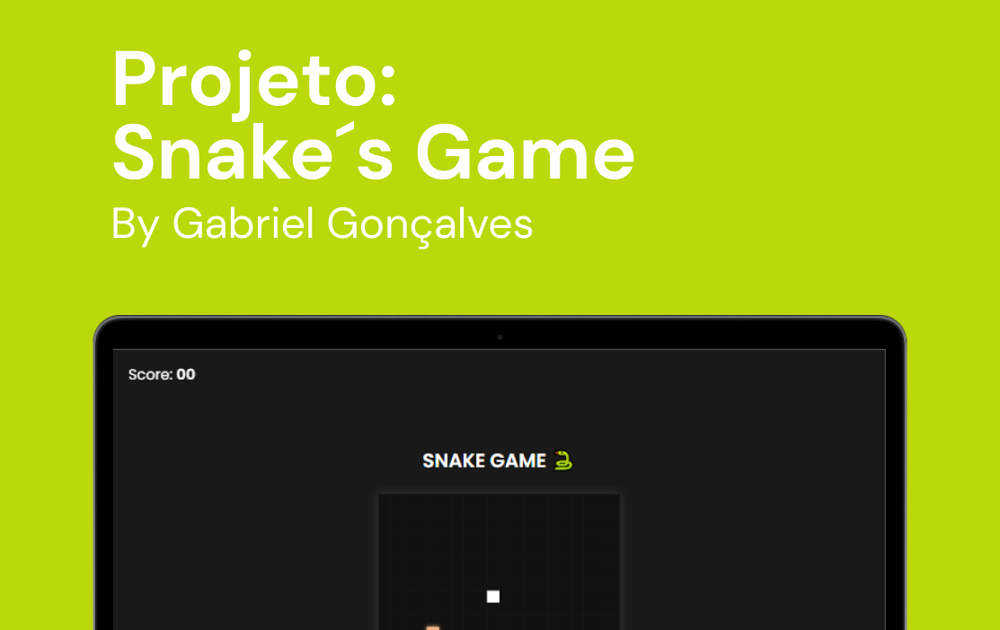
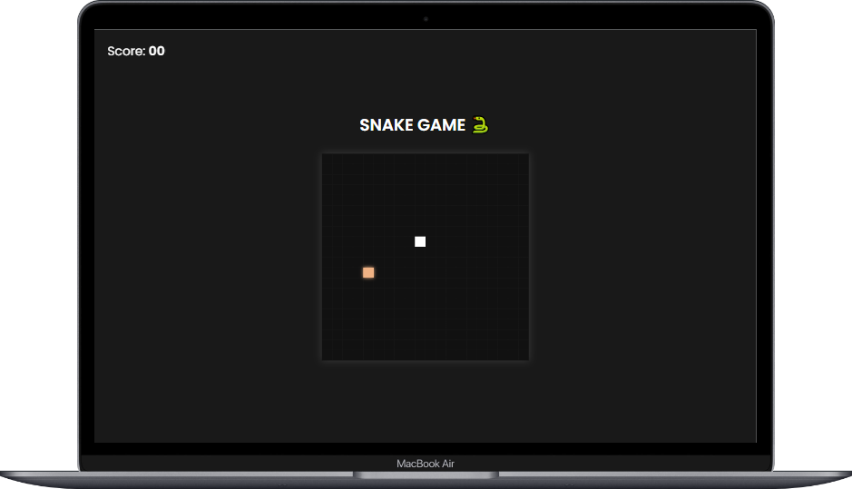
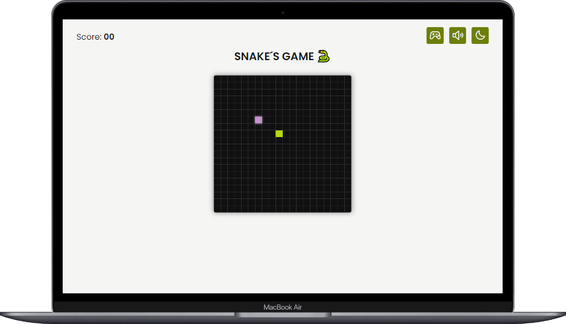

<h1 align="center">
  Snake´s Game 🐍
</h1>

  <a href="#-layout">Layout</a>&nbsp;&nbsp;&nbsp;|&nbsp;&nbsp;&nbsp;
  <a href="#-tecnologias">Tecnologias</a>&nbsp;&nbsp;&nbsp;|&nbsp;&nbsp;&nbsp;
  <a href="#-projeto">Projeto</a>&nbsp;&nbsp;&nbsp;|&nbsp;&nbsp;&nbsp;
  <a href="#-licença">Licença</a>&nbsp;&nbsp;&nbsp;|&nbsp;&nbsp;&nbsp;
  <a href="#-contato">Contato</a> 
  &nbsp;&nbsp;&nbsp;|&nbsp;&nbsp;&nbsp;
  <a href="#%EF%B8%8F-versão-desktop">Versão Desktop</a>

 

 
   

## 🎨 Layout

Aqui você pode conferir o layout do projeto.  

[👉 Link para visualizar a versão WEB](https://snake-game-desktop.vercel.app/)

 

 

 

 

 

 

---

## 🚀 Tecnologias

Esse projeto foi desenvolvido com as seguintes tecnologias:

 
 
 
 
 

## 💻 Projeto

"Snake's Game" é um projeto do clássico jogo da cobra, desenvolvido com uma mistura de tecnologias web modernas, incluindo HTML, CSS, SASS, JavaScript, TypeScript, Node.js e Electron.

## 🖥️ Versão Desktop
"Snake's Game" é multi-plataforma e oferece uma versão desktop para uma experiência de jogo mais confortável caso queira executar em seu computador. Para acessar a versão desktop, basta baixar o projeto e executar'<strong>npm i</strong>' e '<strong>npm run start</strong>' na pasta raiz do app. Você terá acesso a uma interface de desktop por meio do electron, onde também é possível executar '<strong>npm run make</strong>' para gerar uma pasta com o instalador do Snake´s Game.

## 📝 Licença

Esse projeto está sob a licença MIT. Veja o arquivo [LICENSE](LICENSE) para mais detalhes.

## 🌐 Contato

 

---

Feito com ♥ by Gabriel Gonçalves 🖖 &nbsp;&nbsp;&nbsp;|&nbsp;&nbsp; <a href="#--snakes-game-">Voltar para o Inicio ⬆️ </a>
